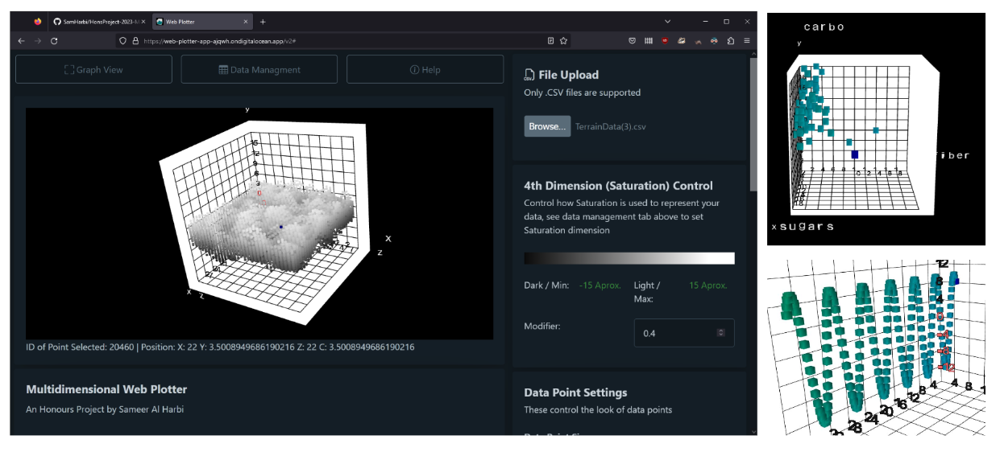

  

# Web-based Multidimensional Data Plotter
This Repo holds all technical work and planning for my Honours in Computing Science final project at the University of Dundee, completed in Summer 2023 with a 1st Class final grade.

# Description
The Plotter is a Client-side Web App written in TypeScript with WebGL 1.0 that is capable of loading in large .CSV data and effectively rendering them in 3D+ space using a purpose built rendering engine. Deployed on Digital Ocean.

See the submitted paper: 

# Deployment / Try it out
Version 1 of the application is hosted here: https://web-plotter-app-ajqwh.ondigitalocean.app/

Version 2: https://web-plotter-app-ajqwh.ondigitalocean.app/v2

User Testing 1 instructions page on: https://samharbi.github.io/TestingInstructions/

# Repository Structure
This project was done using a agile subset of XP optimised for a single-person team. Three branches make up the full developement lifecycle of Development -> Refactor -> Production. Copies of Major versions are branched off onto seperate orphan branches. For quick links see the following:

WebGL Test v0.0.1: https://github.com/SamHarbi/HonsProject-2023-Multidimensional-Plotter/tree/WebGL-Test-0

Web Plotter v1.0.0: https://github.com/SamHarbi/HonsProject-2023-Multidimensional-Plotter/tree/v1.0-Web-Plotter

Web Plotter v2.0.0: 

Web Plotter Latest/Production: https://github.com/SamHarbi/HonsProject-2023-Multidimensional-Plotter/tree/Production